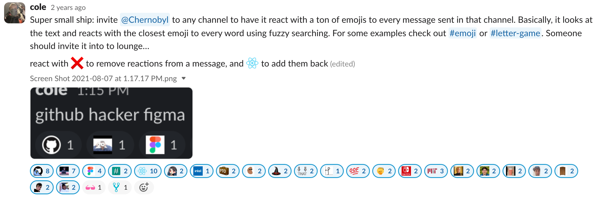

# EmojiSpam
a simple Slack app that reacts with emojis that "best represent" (kind of...) the message that was sent in a channel.

I used https://github.com/lambtron/emojipacks and https://github.com/smashwilson/slack-emojinator for bulk uploads.
